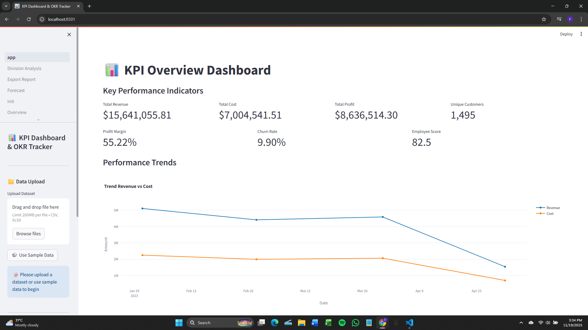
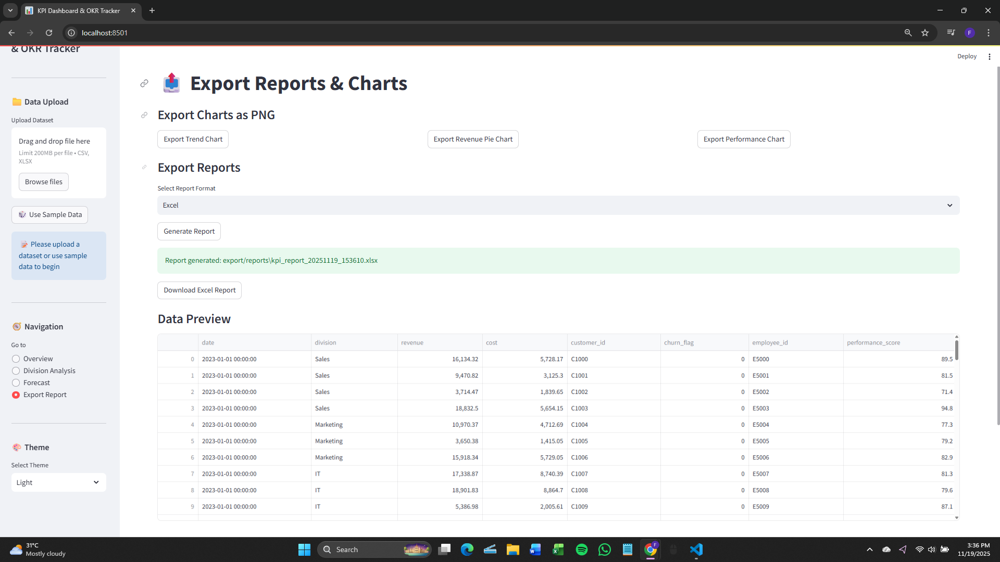
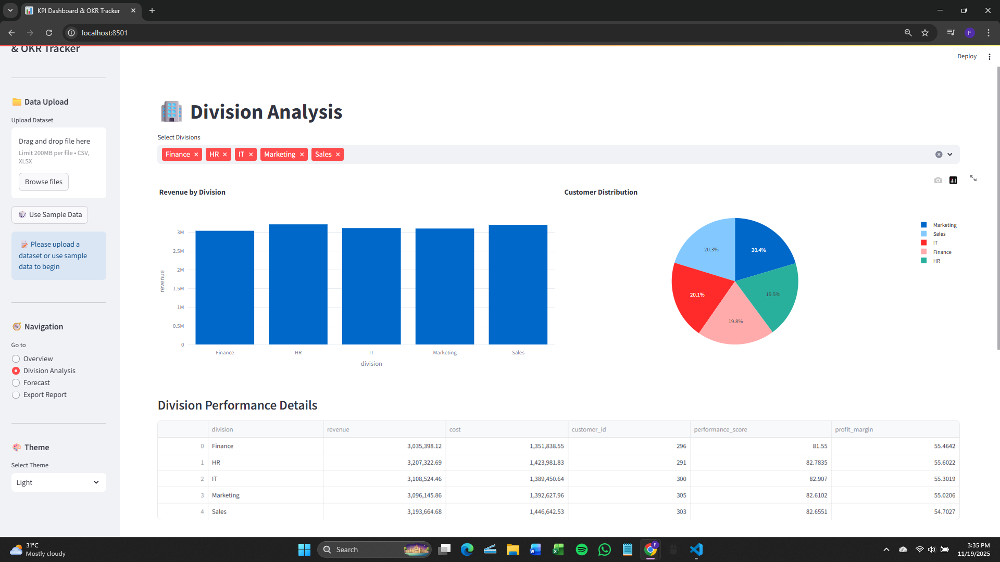
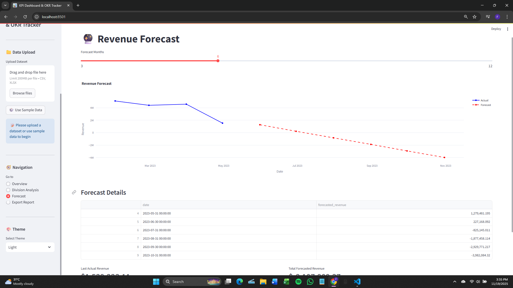
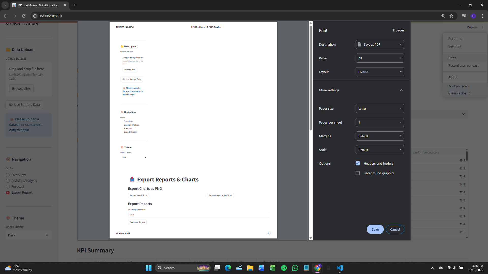

# 📊 KPI Dashboard & OKR 

A powerful, interactive dashboard for monitoring Key Performance Indicators (KPI) and Objectives and Key Results (OKR) in real-time. Built with **Streamlit**, enhanced with advanced analytics, forecasting, and export capabilities.

<p align="center">
  
</p>

---

## ✨ Features

A high-level overview of all key capabilities supported by the dashboard.

---

### 📈 Real-time KPI Monitoring

<p align="center">
  
</p>

- **Automated KPI Calculation** — revenue, cost, profit margin, customer growth, churn rate, employee performance  
- **MoM/YoY Comparison**  
- **Interactive Metric Cards with Trend Indicators**  
- **Advanced Filtering** by date range, division, and KPIs  

---

### 🏢 Division Performance Analysis

<p align="center">
  
</p>

- Compare performance across multiple divisions  
- Revenue contribution breakdown (pie & bar charts)  
- Employee performance scoring per department  
- Division-level drill-down and filtering options  

---

### 🔮 Revenue Forecasting

<p align="center">
  
</p>

Powered by **Linear Regression (scikit-learn)** with automatic trend detection:

- Forecast **3–12 months ahead**  
- Detect seasonality patterns  
- Visual confidence indicators  
- Compare predictions vs actual performance  
- Adjustable forecast horizon  

---

### 📤 Export & Reporting

<p align="center">
  
</p>

- Export reports to **PDF, Excel, CSV, and PNG**  
- Auto-generated business reports with clean layout  
- Export individual charts or batch exports  
- Supports print-ready formatting  

---

### 🎨 Interactive Visualizations

<p align="center">
  
</p>

- Line, Area, Bar, Pie, and Donut charts  
- Trend & correlation visualizations  
- Division comparison visual analytics  
- Fully interactive charts with tooltips & filters  


## 🚀 Quick Start

### Prerequisites
- Python 3.8+
- pip package manager

### Installation

1. **Clone the repository**:
```bash
git clone https://github.com/username/kpi-dashboard.git
cd kpi-dashboard
```

2. **Install dependencies**:
`
pip install -r requirements.txt
`
3. **Generate sample data (optional)**:
`
python data/sample_data_generator.py
`
4. **Run the application**:
`
streamlit run app.py
`
5. Open your browser and navigate to http://localhost:8501

Project Structure
```
kpi_dashboard/
├── app.py                 # Main application entry point
├── requirements.txt       # Python dependencies
├── README.md             # Project documentation
│
├── config/               # Configuration files
│   ├── settings.yaml     # Application settings
│   └── __init__.py
│
├── data/                 # Data management
│   ├── sample_data.xlsx  # Sample dataset
│   ├── sample_data_generator.py
│   └── uploaded/         # User-uploaded files
│
├── pages/                # Streamlit multi-page application
│   ├── Overview.py       # Main dashboard
│   ├── Division_Analysis.py
│   ├── Forecast.py
│   └── Export_Report.py
│
├── utils/                # Core functionality modules
│   ├── data_loader.py    # Data loading and validation
│   ├── preprocess.py     # Data cleaning and preprocessing
│   ├── kpi_calculator.py # KPI calculation engine
│   ├── visualizer.py     # Chart and graph generation
│   ├── forecast_model.py # ML forecasting models
│   ├── export_handler.py # Report and chart export
│   ├── formatter.py      # Data formatting utilities
│   ├── helpers.py        # Helper functions
│   └── __init__.py
│
├── export/               # Generated exports
│   ├── charts/           # Exported visualization images
│   └── reports/          # Generated reports (PDF, Excel, CSV)
│
└── logs/                 # Application logs
    └── app.log
```

Data Schema
Your dataset should include these required columns:

## Data Schema (Required Columns)

| Column            | Type    | Description                                |
|-------------------|---------|--------------------------------------------|
| date              | Date    | Transaction/record date                    |
| division          | String  | Department/division name                   |
| revenue           | Numeric | Revenue amount                             |
| cost              | Numeric | Cost amount                                |
| customer_id       | String  | Unique customer identifier                 |
| churn_flag        | Binary  | 1/0 or yes/no indicating churn             |
| employee_id       | String  | Employee identifier                        |
| performance_score | Numeric | 0–100 employee performance score           |


🛠️ Configuration

Modify config/settings.yaml to customize:
``
app_name: "KPI Dashboard & OKR"
default_kpi:
  - revenue
  - cost
  - profit_margin
  - customer_growth
  - churn_rate
  - employee_score

forecast:
  default_months: 6
  min_months: 3
  max_months: 12
``

📈 Supported KPI Metrics
Financial: Revenue, Cost, Profit Margin

Customer: Customer Growth, Churn Rate

Employee: Performance Score

Growth: MoM (Month-over-Month), YoY (Year-over-Year)

🔮 Forecasting Methodology
The forecasting module uses:

Linear Regression for trend prediction

Automatic seasonality detection

Configurable forecast horizons (3-12 months)

Historical data validation (minimum 3 months required)

🎯 Use Cases
Business Intelligence: Real-time performance monitoring

Executive Reporting: Automated KPI reporting for management

Department Analysis: Division-wise performance tracking

Strategic Planning: Data-driven decision making with forecasts

OKR Tracking: Objective and Key Results monitoring

🤝 Contributing
Fork the project

Create your feature branch (git checkout -b feature/AmazingFeature)

Commit your changes (git commit -m 'Add some AmazingFeature')

Push to the branch (git push origin feature/AmazingFeature)

Open a Pull Request

📄 License
This project is licensed under the MIT License - see the LICENSE file for details.

🙏 Acknowledgments
Built with Streamlit

Charts powered by Plotly

Forecasting with Scikit-learn

Icons from Font Awesome
